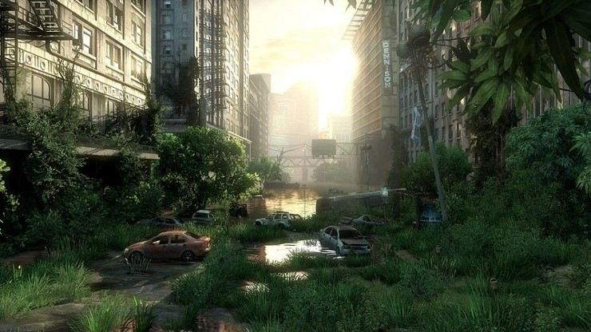

# Educational Project Final

   
  
   

목차

1. 프로젝트 개요
2. 진행한 작업
3. 느낀점

## 1. 프로젝트 소개

<table>
  <tr>
    <td style="width: 30%; vertical-align: top;">
      
    </td>
    <td style="width: 70%; vertical-align: top; text-align: left;">
      <h3>프로젝트 개요/동기</h3>
      <ul>
        <li>7주간 5인으로 진행한 프로젝트</li>
		<li>데디케이트 서버를 활용한 루트슈터 장르</li>
		<li>하우징 기능</li>
		<li>필드 맵으로 나가서 아이템을 획득하고 홈타운으로 돌아와서 획득한 아이템을 팔아서 재화를 얻는 플로우</li>
      </ul>
    </td>
  </tr>
</table>

## 기술 스택

|	GitHub	|UnrealEngine|	Blender		|
| :------: 	| 	:------: |	:------: 	|
| ![github]	| 	![ue]	 |		![bd]	|

 

## 2. 진행한 작업

### 2-1. 전체적인 시스템 구현 및 디버깅

### 2-2. 플레이어 기본 기능 구성
<table>
  <tr>
    <td style="width: 70%; vertical-align: top; text-align: left;">
      <ul>
			<li>캐릭터 베이스 작성</li>
			<li>캐릭터 베이스 -> 플레이어 캐릭터 -> 모캡 캐릭터 순으로 상속하여 기능 분할</li>
			<li>캐릭터 베이스 -> 에너미 캐릭터 순으로 상속하여 전투 관련 시스템은 캐릭터 베이스로 통합관리</li>
      </ul>
    </td>
  </tr>
</table>

### 2-3. 기존에 사용하던 기본기능들 해당 프로젝트에 맞게 변경

### 2-4. 캐릭터 기능 관련 디버깅 진행
<table>
  <tr>
    <td style="width: 70%; vertical-align: top; text-align: left;">
      <ul>
			<li>모캡 애니메이션 디버깅 진행</li>
			<li>기존 작업해놓은 기능들이 새로운 기능과 충돌날 경우 수정</li>
			<li>일부 기능과 기능의 초기화 타이밍문제 디버깅</li>
      </ul>
    </td>
  </tr>
</table>

### 2-5. 인벤토리 기능 디버깅 지원
<table>
  <tr>
    <td style="width: 70%; vertical-align: top; text-align: left;">
      <ul>
			<li>퀵슬롯 기능 미작동</li>
			<li>장착한 장비와 매쉬가 다르게 나오는 현상</li>
			<li>Load시 상이한 아이템을 장착한 현상</li>
      </ul>
    </td>
  </tr>
</table>

### 2-6. 네트워크 기능이 부족하거나 이상현상이 있는 점 디버그 / 수정

### 2-7. 좀비 에너미 및 좀비 AI 구현
<table>
  <tr>
    <td style="width: 100%; vertical-align: top;">
      
    </td>
  </tr>
  <tr>
    <td style="width: 100%; vertical-align: top; text-align: left;">
      <ul>
        <li>시각과 청각을 이용하는 AI 구현</li>
        <li>시각, 청각에 노이즈가 많이 쌓일수록 더 빠른 속도로 이동</li>
        <li>짧은 시야를 갖고 있지만 한번 시야에 들어온 플레이어를 놓치게 되기까지는 오랜 시간이 필요하게 구성</li>
        <li>주변에서 발소리가 들리면 서서히 발소리 위치로 이동을 시작</li>
        <li>총기류를 너무 쉽게 사용하지 못하게 하기 위해 상당히 먼 거리의 총소리도 들을 수 있으며 소리의 발원지로 이동</li>
        <li>발원지로 이동하는 중 추가적인 소리가 감지되지 않으면 점점 이동속도가 줄어듦</li>
      </ul>
    </td>
  </tr>
</table>

### 2-8. 데디케이트 서버 구현
<table>
  <tr>
    <td style="width: 30%; vertical-align: top;">
      
    </td>
    <td style="width: 70%; vertical-align: top; text-align: left;">
      <ul>
			<li>작업분량 중 서버구현 관련이 상당량을 차지하게 될 걸 예상하였으나 여의치 않아 최대한 손 가지 않는 방식으로 구현</li>
			<li>정석이라면 각 서버마다 세션을 열고, 클라이언트는 해당 세션을 찾아 들어가게 구성이 되어야 하겠지만
			세이프존 레벨과 필드 레벨을 고정포트로 설정하여 실행시키고 
			클라이언트쪽에선 설정파일에 서버의 IP주소를 입력하여 url로 들어가는 방식으로 구현</li>
			<li>맵에서 맵 이동또한 마찬가지로 설정된 고정포트의 url로 Travel진행</li>
			<li>맵간 이동시 데이터는 소켓통신으로 넘기려 하였으나 세이브/로드파일로 구현이 가능하다 판단되어 드랍</li>
      </ul>
    </td>
  </tr>
</table>

### 2-9. 블랙보드[런처 to 런처 / 맵 to 맵] 및 Travel Actor 구현
<table style="width: 100%; border-spacing: 0;">
  <tr>
    <td style="width: 50%; vertical-align: top; text-align: center; padding: 10px;">
      
      
    </td>
    <td style="width: 50%; vertical-align: top; text-align: center; padding: 10px;">
	  
      
    </td>
  </tr>
  <tr>
    <td colspan="2" style="text-align: left; padding: 10px; vertical-align: top;">
      <ul>
        <li>맵간 이동에 사용하는 공통기능으로 파생된 2개의 액터</li>
        <li>HomeTown->House 또는 HomeTown->Field로 이동하는 블랙보드</li>
        <li>Field->HomeTown으로 이동하는 TravelActor</li>
      </ul>
    </td>
  </tr>
</table>

### 2-10. 세이브, 로드기능
<table>
  <tr>
    <td style="width: 30%; vertical-align: top;">
      
	  
    </td>
    <td style="width: 70%; vertical-align: top; text-align: left;">
      <ul>
			<li>클라이언트에서는 Save/Load가 필요할 때 마다 서버에 요청을 하고 서버에서 요청자의 이름으로 된 Save파일의 데이터를 전달</li>
      </ul>
    </td>
  </tr>
</table>

### 2-11. 하우징
<table>
  <tr>
    <td style="width: 30%; vertical-align: top;">
      
    </td>
    <td style="width: 70%; vertical-align: top; text-align: left;">
      <ul>
			<li>다른 팀원이 진행하던 하우징 기능 마무리작업</li>
			<li>하우징 기능 중 플레이어별 하우스 소유권 관리기능 컨셉 변경</li>
			<li>소유한 하우스로 이동하는 기능 변경</li>
			<li>Place하는 기능 일부 수정</li>
			<li>에셋 피벗이 틀어져있는것들 정리작업 등의 디테일 작업</li>
      </ul>
    </td>
  </tr>
</table>

### 2-12. 파티 기능
<table>
  <tr>
    <td style="width: 30%; vertical-align: top;">
      
    </td>
    <td style="width: 70%; vertical-align: top; text-align: left;">
      <ul>
			<li>파티 시스템을 완전히 구현한 단계까지는 작업을 하지 못하였으나 전투 시스템에서 파티원간의 공격이 불가능하게 처리</li>
			<li>HomeTown[MainServer]에서는 플레이어간 공격이 불가하게 동일한 파티 태그로 묶어서 처리</li>
			<li>Enemy간에는 동일한 파티 태그로 묶여있어 서로 공격이 불가능</li>
			<li>에너미의 종류 확장 시 서로 다른 소속의 에너미간 공격이 가능하게 할 예정이었음</li>
      </ul>
    </td>
  </tr>
</table>

### 2-13. 아이템 스포너, 에너미 스포너 구현
<table style="width: 100%; border-spacing: 0;">
  <tr>
    <td style="width: 50%; vertical-align: top; text-align: center; padding: 10px;">
      
    </td>
    <td style="width: 50%; vertical-align: top; text-align: center; padding: 10px;">
	  
    </td>
  </tr>
  <tr>
    <td colspan="2" style="text-align: left; padding: 10px; vertical-align: top;">
      <ul>
			<li>많은수의 루트 컨테이너와 에너미가 있어 스포너를 이용하여 객체관리</li>
			<li>에너미가 죽을경우 일정시간 후 Destroy시킨뒤 다시 스폰하는 방식으로 구현</li>
			<li>스포너의 경우 일정시간마다 빈 컨테이너를 감지하여 랜덤 아이템 부여</li>
      </ul>
    </td>
  </tr>
</table>

### 2-13. UI작업
<table>
  <tr>
    <td style="width: 30%; vertical-align: top;">
      
    </td>
    <td style="width: 70%; vertical-align: top; text-align: left;">
      <ul>
			<li>게임 시작 / 맵이동간 로딩화면</li>
			<li>HomeTown으로 갈 때 / 필드로 나갈 때 서로 다른 이미지가 출력되게 작업</li>
			<li>HP 위젯 및 기능 작업</li>
			<li>시퀀스 플레이어 위젯 및 기능 작업</li>
      </ul>
    </td>
  </tr>
</table>

### 2-14. Git 관리
<table>
  <tr>
    <td style="width: 30%; vertical-align: top;">
      
    </td>
    <td style="width: 70%; vertical-align: top; text-align: left;">
      <ul>
		<li>여러 브랜치에서 수시로 동시수정 파일이 올라오게 되어 BeyondCompare라는 텍스트 컴페어툴로 작업관리 진행</li>
        <li>2차 프로젝트에서의 깃 관리 실패로 인해 얻은 교훈으로 디렉토리 관리를 철저히 하고싶었으나 자유로운 디렉토리 사용이 아쉬움이 있는 프로젝트</li>
		<li>그래도 게임 개발 프로젝트 관리를 좀 해보며 얻은 경험으로 시작과 끝까지 깃과 함께 할 수 있었던 프로젝트</li>
      </ul>
    </td>
  </tr>
</table>

 

## 3. 느낀점

- 이제는 게임 개발을 위한 최저한의 지식은 확보가 되었다
- 메인작업은 최소로 잡고 백업 위주로만 작업을 진행하였는데도 아직은 내 실력이 부족함을 체감
- 팀원 중 아트분야를 희망하는 팀원이 있었는데 해당 팀원을 케어해 줄 지식이 없는게 아쉬웠음
- MFC로만 개발하던 기존 환경이 얼마나 협소한지를 체감

 

## 라이센스

MIT &copy; [NoHack](mailto:lbjp114@gmail.com)

<!-- Stack Icon Refernces -->

[git]: /images/stack/Git.svg
[github]: /images/stack/GithubDesktop.svg
[ue]: /images/stack/UnrealEngine.svg
[bd]: /images/stack/Blender.svg
[c++]: /images/stack/C++.svg
[mfc]: /images/stack/Microsoft_Foundation_Class.svg
